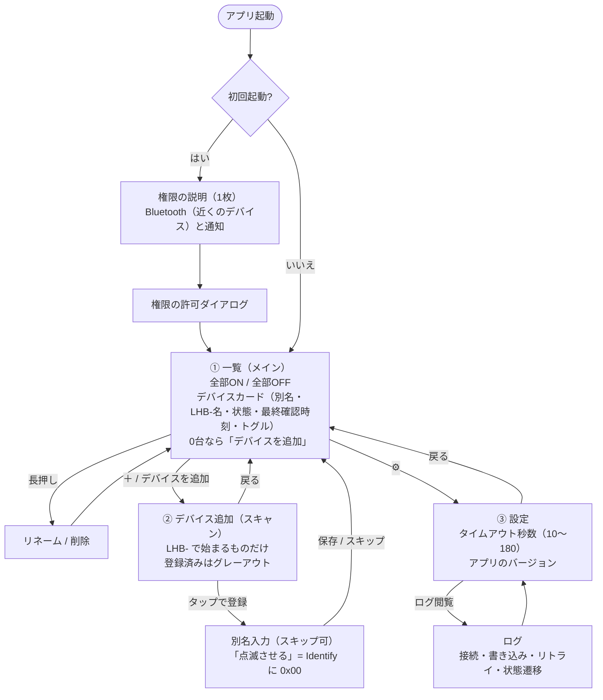

最終更新: 0.1.0

# 04. 画面遷移

```mermaid
flowchart TB
    Start([アプリ起動]) --> First{初回起動?}
    First -- はい --> Explain["権限の説明（1枚）<br/>Bluetooth（近くのデバイス）と通知"]
    Explain --> Dialog["権限の許可ダイアログ"]
    Dialog --> List
    First -- いいえ --> List

    List["① 一覧（メイン）<br/>全部ON / 全部OFF<br/>デバイスカード（別名・LHB-名・状態・最終確認時刻・トグル）<br/>0台なら「デバイスを追加」"]
    List -- "長押し" --> Menu["リネーム / 削除"]
    Menu --> List

    List -- "＋ / デバイスを追加" --> Scan["② デバイス追加（スキャン）<br/>LHB- で始まるものだけ<br/>登録済みはグレーアウト"]
    Scan -- "タップで登録" --> Alias["別名入力（スキップ可）<br/>「点滅させる」= Identify に 0x00"]
    Alias -- "保存 / スキップ" --> List
    Scan -- "戻る" --> List

    List -- "⚙" --> Settings["③ 設定<br/>タイムアウト秒数（10〜180）<br/>アプリのバージョン"]
    Settings -- "ログ閲覧" --> Log["ログ<br/>接続・書き込み・リトライ・状態遷移"]
    Log --> Settings
    Settings -- "戻る" --> List
```

- 初回だけ権限の説明画面を挟む。通知を拒否されても先に進め、処理も動く
- Bluetooth の権限が拒否されている場合の扱い（再説明・設定アプリへの誘導）は段階8で決めて、この図に追記する
- 登録はタップした時点で行い、別名入力をスキップしても登録は残る
